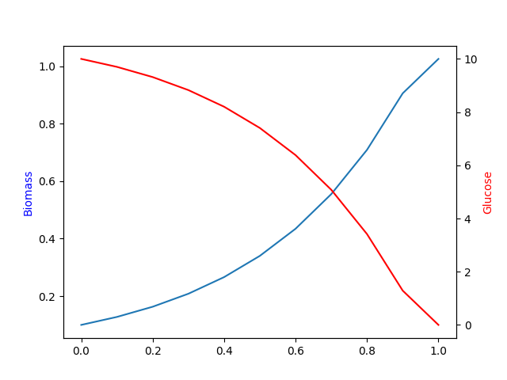

3. Dynamic FBA
==============

Dynamic Flux Balance Analysis (dFBA) stands as a powerful computational framework that merges the principles of Flux Balance Analysis (FBA) with dynamic modeling, 
enabling the simulation and analysis of time-evolving metabolic processes within biological systems. Here we've implemented the Static Optimization approach as described 
by *Mahadevan et. al (2002)* [#ref_dfba]_. 

Simply put, dynamic FBA performs FBA foreach given time point and calculates the fluxes through the system at the beginning of that time point.  
With each iteration, external metabolites and biomasses are adjusted, followed by another FBA run. This process continues until the objective function becomes infeasible (e.g. by a lack of nutrients), 
or the final time point is reached. This modeling approach enables the exploration of metabolic network adjustments to evolving environmental factors, substrate availability, and cellular demands.

Making it dynamic!
------------------

To perform dFBA run the following: 

.. code-block:: python
   
    import cbmpy
    from DCFBA.DynamicModels import DynamicSingleFBA
    from DCFBA.Models import KineticsStruct
    import matplotlib.pyplot as plt

    model = cbmpy.loadModel("models/bigg_models/e_coli_core.xml") #load the model 

    initial_biomass = 0.1 #Set the initial biomass
    initial_concentrations = {"M_glc__D_e": 10} #We start with 10 mM of glucose

    ds = DynamicSingleFBA(
        model,
        "R_BIOMASS_Ecoli_core_w_GAM", 
        initial_biomass,
        initial_concentrations,
    ) # Define a DynamicSingleFBA object given the model and the id of the biomass reaction 

    T, metabolites, biomasses, fluxes = ds.simulate(dt=0.1) 

    #Plot the results
    ax = plt.subplot(111)
    ax.plot(T, biomasses[""])
    ax2 = plt.twinx(ax)
    ax2.plot(T, metabolites["M_glc__D_e"], color="r")

    ax.set_ylabel("Biomass", color="b")
    ax2.set_ylabel("Glucose", color="r")
    plt.show()

The ``DynamicSingleFBA.simulate()`` method accepts :math:`{\delta}` t as a parameter, representing the time step taken during each iteration. 
It yields a comprehensive output including the visited time steps, metabolite concentrations, biomass concentrations, and the fluxes of individual reactions at each time point.

.. [#ref_dfba] Mahadevan, R., Edwards, J. S., & Doyle, F. J. III. (Year). Dynamic Flux Balance Analysis of Diauxic Growth in Escherichia coli. Biophysical Journal Volume 83 September 2002 1331 1340 
