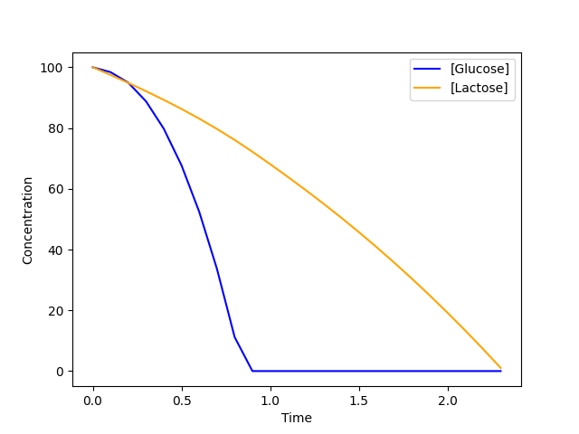

5. Dynamic Joint FBA 
====================

Now that we've defined and can construct a ``CommunityModel`` let's dive into its practical use for studying how different organisms function collectively.
In this section, we'll introduce the initial approach for modeling microbial communities, known as Dynamic Joint FBA. This method allows researchers to simulate the 
interactions between different organisms at the community level using Dynamic Joint FBA. Through this, we can uncover valuable insights into the interdependencies, 
collaborations, competitions, and overall dynamics present within the community of organisms.

The core principle behind Dynamic Joint FBA is quite straightforward. Firstly, we introduce a new species into the model, which we aptly term the `community biomass`
denoted as ``X_c``. Next, we integrate ``X_c`` to be a product of the biomass reactions of all the models used to build the community matrix. 
Finally, we set the objective function to the exchange reaction of ``X_c``. 
By doing so Dynamic Joint FBA effectively identifies the most optimal flux distribution through the system, that maximizes the creation of community biomass.

Example
--------

Here we will give use the example of a combining the  *E. coli core metabolism* model with the *Streptococcus thermophilus* (iRZ476) model.
To perform the Dynamic Joint FBA we first define the ``CommunityModel`` and use this to initialize a ``DynamicJointFBA`` object:

.. code-block:: python

    import matplotlib.pyplot as plt
    import cbmpy
    from cbmpy.CBModel import Model
    from DCFBA.Models import CommunityModel
    from DCFBA.DynamicModels import DynamicJointFBA

    model1: Model = cbmpy.loadModel("models/bigg_models/e_coli_core.xml") #load e_coli core
    model2: Model = cbmpy.loadModel("models/bigg_models/strep_therm.xml") #load the Streptococcus model

    #Set the import bounds for glucose in both models
    model1.getReaction("R_GLCpts").setUpperBound(10) 
    model2.getReaction("R_GLCpts").setUpperBound(6)

    #The biomass reactions ids 
    biomass_reaction_model_1: str = "R_BIOMASS_Ecoli_core_w_GAM"
    biomass_reaction_model_2: str = "R_biomass_STR"

    cm = CommunityModel(
        [model1, model2],
        [biomass_reaction_model_1, biomass_reaction_model_2],
        ["ecoli", "strep"],
    ) #Define the community model

    dynamic_fba = DynamicJointFBA(
        cm, [1.0, 1.0], {"M_glc__D_e": 100, "M_gal_e": 0, "M_lcts_e": 100}
    ) #Create a DynamicJointFBA object, set the initial concentrations of glucose and lactose to 100

Now that the model is in place we can run the simulation using time steps of 0.1:

.. code-block:: python

    T, metabolites, biomasses, fluxes = dynamic_fba.simulate(0.1)

The ``simulate`` method returns a tuple with four elements. First, it provides a list of time points for the simulation. 
Second, it returns a ``Dictionary`` containing the species_ids and their corresponding concentrations at each time point. Third, we get a 
``Dictionary`` containing the biomasses of the models, accessed through their IDs. Lastly we get the fluxes of all reactions for each time point.

You can now easily plot the species concentration over time:

.. code-block:: python

    plt.plot(T, metabolites["M_glc__D_e"], color="blue", label="[Glucose]")
    plt.plot(T, metabolites["M_lcts_e"], color="orange", label="[Lactose]")

    plt.xlabel("Time")
    plt.ylabel("Concentration")
    plt.legend()
    plt.show()
  

     
And the biomasses of both species over time

.. code-block:: python
    
    plt.plot(T, biomasses["ecoli"], color="orange", label="ecoli")
    plt.plot(T, biomasses["strep"], color="blue", label="strep")
    
    plt.xlabel("Time")
    plt.ylabel("Concentration")
    plt.legend()
    plt.show()

     
