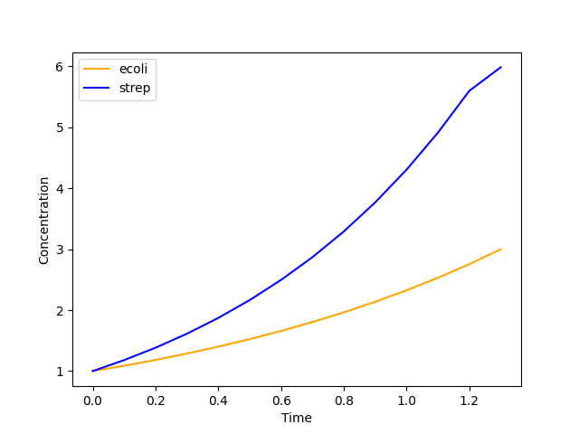

6. Dynamic Parallel FBA
=======================

The second method to model microbial interactions available through this package is Dynamic Parallel FBA (dpFBA). 
The key idea is to perform FBA on individual models while keeping track of the *pool* or *medium* of external metabolites from which all models can take up nutrients.
Again we keep track of the overall concentrations of biomass and external metabolites and update this using the set time interval.

Example
-------
To run a simulation with Dynamic Parallel FBA, you first need to define your ``ParallelDynamicFBA`` model.

.. code-block:: python

    import matplotlib.pyplot as plt
    from cbmpy.CBModel import Model
    from dcFBA import DefaultModels
    from dcFBA.DynamicModels import DynamicParallelFBA

    model1: Model = DefaultModels.read_default_model("e_coli_core")
    model2: Model = DefaultModels.read_default_model("strep_therm")

    # Exchange reaction are not set correctly, here we fix this
    for rid in model1.getReactionIds():
        if rid.startswith("R_EX"):
            reaction = model1.getReaction(rid)
            reaction.is_exchange = True

    for rid in model2.getReactionIds():
        if rid.startswith("R_EX"):
            reaction = model2.getReaction(rid)
            reaction.is_exchange = True

    # Give the two models different glucose uptake rates
    model1.getReaction("R_GLCpts").setUpperBound(10)
    model2.getReaction("R_GLCpts").setUpperBound(6)

    # Restrict Lactose uptake
    model2.getReaction("R_LCTSGALex").setLowerBound(0)
    model2.getReaction("R_LCTSt6").setUpperBound(30)

The ``DynamicParallelFBA`` class accepts a list of N models. In this example, we use two models as described before.

Next, we specify the initial concentrations of both models and the initial concentrations of the external species.
.. code-block:: python
        
    parallel_fba = DynamicParallelFBA(
        [model1, model2],
        [1.0, 1.0],
        {
            "M_glc__D_e": 100,
            "M_succ_e": 0,
            "M_glu__L_e": 0.0,
            "M_gln__L_e": 0.0,
            "M_lcts_e": 100,
        },
    ) #Build DynamicParallelFBA model

To run the simulation, use the following code:

.. code-block:: python

    parallel_fba.simulate(0.1)

The ``simulate`` runs the dynamic analysis until no organism can grow or one of the solutions is infeasible. Again we store 
the intermediate results for biomasses, metabolites and fluxes in the model and can retrieve them once the simulation is done:

.. code-block:: python

    biomasses = parallel_fba.get_biomasses()
    metabolites = parallel_fba.get_metabolites()
    T = parallel_fba.get_time_points()
    fluxes = parallel_fba.fluxes

Using simple plotting functions from ``matplotlib.pyplot``, you can visualize the results easily:

.. code-block:: python

    plt.plot(T, metabolites["M_glc__D_e"], color="blue", label="[Glucose]")
    plt.plot(T, metabolites["M_lcts_e"], color="orange", label="[Lactose]")

    plt.xlabel("Time")
    plt.ylabel("Concentration")
    plt.legend()
    plt.show()

Alternatively, you can plot the biomasses over time:

.. code-block:: python

    #Plot biomasses
    plt.plot(T, biomasses[model1.getId()], color="orange", label="ecoli")
    plt.plot(T, biomasses[model2.getId()], color="blue", label="strep")

    plt.xlabel("Time")
    plt.ylabel("Concentration")
    plt.legend()
    plt.show()

