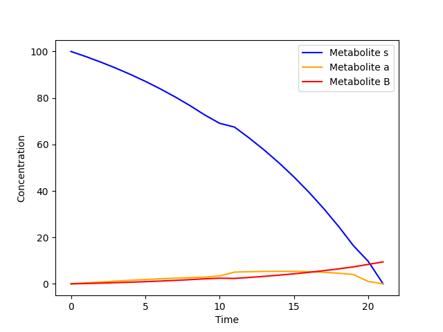
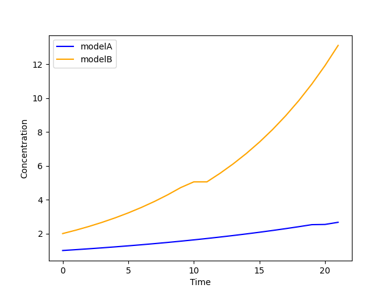
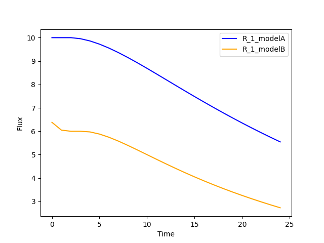

7. EndPointFBA 
==============

The final method implemented in this package is called `EndPointFBA` (epFBA). 
EndPointFBA is a dynamic simulation method for microbial 
communities provided by this package. 

In contrast to the previous methods, epFBA does not perform FBA, updates biomasses and metabolite concentrations per time step. 
Rather, we duplicate the original GSMM for N time steps of size δt and connect each of these models chronologically, 
such that metabolites and biomass can flow from time point to time point, but never backwards. This creates a multi-organism, multi-time-step compartmentalization of the original model. 
After comprising such a time-step dependent GSMM, we perform FBA on the entire model. 
Just like djFBA, we maximize the community biomass. For djFBA, this is calculated for every time step, 
while here we maximize the exchange of community biomass in the final time point.

For a more extensive explanation of epFBA we refer you to the paper [#ref_epFBA]_ .

7.1 Example
-----------

We'll use a lightweight toy model for this example to ensure the 
computational load remains manageable. 

The toy model is bundled with the package:

.. code-block:: python 
    
    from cbmpy.CBModel import Model, Reaction
    from dcFBA.ToyModels import model_a, model_b

    m_a: Model = model_a.build_toy_model_fba_A()

    # Setting some initial bounds on reactions
    m_a.getReaction("R_1").setUpperBound(10)
    m_a.getReaction("R_4").setUpperBound(3)
    m_a.getReaction("R_6").setUpperBound(1)

    m_a.getReaction("R_1").setLowerBound(0)
    m_a.getReaction("R_4").setLowerBound(0)
    m_a.getReaction("R_6").setLowerBound(0)

    # Delete the original biomass model from model A as it is redefined in the endPoint model
    reaction: Reaction = m_a.getReaction("R_BM_A").deleteReagentWithSpeciesRef(
        "BM_e_A"
    )

    m_b: Model = model_b.build_toy_model_fba_B()

    # Setting some initial bounds on reactions
    m_b.getReaction("R_1").setUpperBound(10)
    m_b.getReaction("R_3").setUpperBound(1)
    m_b.getReaction("R_5").setUpperBound(1)

    m_b.getReaction("R_1").setLowerBound(0)
    m_b.getReaction("R_3").setLowerBound(0)
    m_b.getReaction("R_5").setLowerBound(0)

    # Delete the original biomass model from model B
    reaction: Reaction = m_b.getReaction("R_BM_B").deleteReagentWithSpeciesRef(
        "BM_e_B"
    )

Next, let's create the initial ``CommunityModel``:

.. code-block:: python 

    from dcFBA.Models import CommunityModel

    community_model = CommunityModel(
        [m_a, m_b], ["R_BM_A", "R_BM_B"], ["modelA", "modelB"]
    )

To run a simulation with ``EndPointFBA``, you'll need to initialize the object by providing the following:

- The ``CommunityModel``
- The desired number of time points
- Initial concentrations for both biomass and metabolites
- The time step size

.. code-block:: python

    from dcFBA.DynamicModels import EndPointFBA

    n = 25
    ep = EndPointFBA(
        community_model,
        n,
        {"modelA": 1.0, "modelB": 2.0},
        {"S_e": 100, "A_e": 0.0, "B_e": 0.0},
        dt=0.1,
    )

    solution = ep.simulate()
    print(solution)
    # 12.778

This provides the community biomass value after 25 intervals of 0.1 time units each.

7.2 Examining the results
-------------------------

Reactions in the ``EndPointFBA`` model have unique IDs formed by 
appending their original IDs with the time ID (e.g., R_1_timeNN). 
Also, metabolite flow between time points are represented with a 
unique ID combining the metabolite's ID and the start and end 
interval IDs. These ID's are stored in the ``fluxes`` object. To access the flux from a reaction it can be examined as follows:

.. code-block:: python 
    
    fluxes = ep.get_fluxes()

    #Obtain the aggregated flux value of reaction 1 of model A in the fifth time point
    print(fluxes["R_1_modelA_time05"]) #1.2763

The concentration of an external metabolite at a specific time point is retained within the linking reaction between this time-point and the previous. 
This holds true for all external metabolites consumed and synthesized within the system, as they progress through each time step until reaching the final one.
To ascertain the quantity of metabolite X at the commencement of time-step 4, you can access this information using the following linking reaction format: `_ID_time03_time04`, where `_ID` 
denotes the identifier of the original metabolite. This format encapsulates the amount of metabolite transitioning from time-step 3 to time-step 4.

.. code-block:: python 

    #Get the amount of metabolite S on time 1

    print(fluxes["S_e_time00_time01"]) #97.8

    #Get the concentration of metabolite B in time step 22

    print(fluxes["B_e_time21_time22"]) #6.311

    #Get the amount of A at the end of the simulation

    print(fluxes['A_e_exchange_final']) #0.0

Given that this approach may not be the most intuitive method for retrieving information from the object, ``EndPointFBA`` 
follows a similar pattern to other methods by enhancing the core functionality of the ``DynamicModelBase`` class. 
This inheritance grants it the capability to easily access biomasses, metabolites, and fluxes at each time point. 
By leveraging these properties, you can obtain the data in a more straightforward manner, with the values neatly organized per time-step.

.. code-block:: python 

    biomasses = ep.get_biomasses()
    metabolites = ep.get_metabolites()
    fluxes = ep.get_fluxes()
    time = ep.get_time_points()

Now you can retrieve the metabolite concentration of metabolite `S` and the aggregated flux value of reaction `R_1_modelA` using the following code:

.. code-block:: python 
    
    #Concentration of metabolite S on time point 1
    metabolites["S_e"][1]

    #aggregated flux through reaction R_1_modelA
    fs = ep.get_flux_values("R_1_modelA")

    #print the value of the flux at time point 5
    print(fs[5]) #1.2763

`EndPointFBA` uses aggregated fluxes (that is the flux multiplied by `dt` and `biomass`), to obtain the original, or specific flux value you can call the following method:

.. code-block::python 

    fs = ep.get_specific_flux_values("R_1_modelA")
    print(fs[5]) # 10.0

    #Alternately 
    fs = ep.get_flux_values("R_1_modelA")

    print(fs[5] / (ep.dt * biomasses["modelA"][5])) # 10.0

Putting it all together we can again plot the biomasses, metabolites and fluxes over time:

.. code-block:: python

    import matplotlib.pyplot as plt

    plt.plot(
        range(len(time) + 1),
        metabolites["S_e"],
        color="blue",
        label="Metabolite s",
    )
    plt.xlabel("Time")
    plt.ylabel("Concentration")
    plt.legend()

    plt.plot(
        range(len(time) + 1),
        metabolites["A_e"],
        color="orange",
        label="Metabolite a",
    )
    plt.xlabel("Time")
    plt.ylabel("Concentration")

    plt.plot(
        range(len(time) + 1),
        metabolites["B_e"],
        color="red",
        label="Metabolite B",
    )
    plt.xlabel("Time")
    plt.ylabel("Concentration")
    # Adding legend
    plt.legend()
    plt.show()

    plt.plot(
        range(len(time) + 1), biomasses["modelA"], color="blue", label="modelA"
    )
    plt.plot(
        range(len(time) + 1), biomasses["modelB"], color="orange", label="modelB"
    )
    plt.xlabel("Time")
    plt.ylabel("Concentration")
    plt.legend()
    plt.show()

    plt.plot(
        range(len(time)),
        ep.get_specific_flux_values("R_1_modelA"),
        color="blue",
        label="R_1_modelA",
    )

    plt.plot(
        range(len(time)),
        ep.get_specific_flux_values("R_1_modelB"),
        color="orange",
        label="R_1_modelA",
    )
    plt.xlabel("Time")
    plt.ylabel("Flux")
    plt.legend()
    plt.show()

.. image:: ../_static/images/Flux_r_1_epFBA.png
    :width: 500px
    :align: center
    :alt: fluxes

7.3 Advanced constraints
------------------------

EndPointFBA offers additional methods for refining your simulation results, enhancing the biological relevance. Here, we discuss these methods and demonstrate their application.

7.3.1 Enforcing balanced growth
"""""""""""""""""""""""""""""""

A significant advantage of using `EndPointFBA` lies in the fact that all variables are accessible and can be constrained prior to running the simulation. 
Leveraging this capability, we can impose constraints on the model in a way that allows us to fix species abundances or the relative ratios of species within the 
community at both the initial and final time points. By implementing these constraints, we compel the community model to maintain stability, preventing any single organism from persistently outgrowing others. 
Unchecked differential growth rates over time can lead to the dominance of one member within the community, which is often unrealistic in many biological scenarios. 
Therefore, within epFBA, we offer users the option to apply constraints that ensure biomass ratios at the initial and final time points remain equal, 
ensuring a time-averaged community ratio.

To do this you need to know two parameters, the initial total biomass of the system and the desired or final value of the community biomass. 

.. code-block::python

    ep.balanced_growth(2.0, 12.7778)

    ep.simulate()

7.3.2 Optimal time search
"""""""""""""""""""""""""

The ``OptimalSearch.time_search`` module helps determine the optimal number of intervals required to reach the maximum objective method value. By default, the chosen number of intervals might either stretch resources too thinly or not utilize them fully, leading to skewed FBA results.

.. code-block:: python
   
   from dcFBA.OptimalSearch import time_search

   optimal_timepoints = time_search(
       community_model,
       {"modelA": 1.0, "modelB": 2.0},
       {"S_e": 100, "A_e": 0.0, "B_e": 0.0},
       0.1,
   )

   print(optimal_timepoints)  # 21

.. warning::
   Keep in mind, this search might be time-consuming as it involves iterative model construction and simulation.
   
Otherwise, you can use the ``OptimalSearch.time_search`` method to find the number of time points required to reach a certain biomass value.
For example, we know that we can reach the maximal value of the model in 21 time steps. But what if we want an accumulated biomass of 6.5, how long will this take?

.. code-block:: python
    
    optimal_timepoints = time_search(
        community_model,
            {"modelA": 1.0, "modelB": 2.0},
            {"S_e": 100, "A_e": 0.0, "B_e": 0.0},
            0.1,
            [6.5, 21],
    )

    print(optimal_timepoints) #[13, 7.04]

In this context, we've set the initial estimate for 'N' to 21, based on our knowledge that within 21 time steps, we can achieve a value greater than 6.5.
The method returns a list where the first index represents the number of time steps, and the final index indicates the resulting objective value obtained after those time steps.

7.3.3 Restricting reaction bounds
"""""""""""""""""""""""""""""""""

In the context of steady-state microbial community dynamics, drastic changes in reaction rates between two successive time points are unlikely. 
To capture this behavior more accurately, we have implemented two methods to minimize these fluctuations.

The first approach introduces a constraint on the model to ensure that the reaction rate at time ``N`` doesn't vary more than a predefined value, 
:math:`\epsilon`, from its rate at time ``N-1``. 
This method effectively smoothens the fluctuations 
in reaction rates, leading to more biologically plausible results.

.. code-block:: python

    # Activate the additional constraints with epsilon set to 0.1
    ep.constrain_rates(epsilon=0.1) 

    solution = ep.simulate()
    print(solution) # 12.599
    
    FBAsol = ep.m_model.getSolutionVector(names=True)
    FBAsol = dict(zip(FBAsol[1], FBAsol[0]))

     # Print the rates for a particular reaction at successive time points
    print(FBAsol["R_1_modelA_time01"]) #1.062
    print(FBAsol["R_1_modelA_time02"]) #1.128
    print(FBAsol["R_1_modelA_time03"]) #1.975

As demonstrated, the variation in reaction rates between consecutive time points remains within the :math:`\epsilon` boundary of 0.1.

A more sophisticated approach to minimizing fluctuations in reaction rates involves quadratic programming. 
The idea is to set the `EndPointFBA` model's objective to minimize the sum of squared differences between reaction rates at successive time points. Here's how you can employ this approach:

1. First, simulate the `EndPointFBA` model to obtain the optimal solution value, or desired value.
2. Use the obtained optimal solution value as a constraint for the `EndPointFBA` model.
3. Set the new objective function to minimize the sum of squared differences between reaction rates at two consecutive time points.

The resulting objective function is expressed as:

.. math::
   \min \sum_{j, n} (r_{j,n} - r_{j,n+1})^2

Where r\ :sub:`j,n`\ denotes the rate of reaction ``j`` at time point ``n``. 

The following code demonstrates how to implement this approach:

.. code-block:: python

   # Set the objective value of community biomass to 12.77
   ep.set_qp(12.77)

   # Simulate the model with the new quadratic objective
   ep.simulate()

    time = ep.get_time_points()
    
    plt.plot(
        range(len(time)),
        ep.get_specific_flux_values("R_1_modelA"),
        color="blue",
        label="R_1_modelA",
    )

    plt.plot(
        range(len(time)),
        ep.get_specific_flux_values("R_1_modelB"),
        color="orange",
        label="R_1_modelA",
    )
    plt.xlabel("Time")
    plt.ylabel("Flux")
    plt.legend()
    plt.show()

Plotting the same fluxes as we did above we see that we have a much smoother transition of flux value between time points:

Happy modelling!

.. [#ref_epFBA] ep paper